Self-Attention输入Sequence，输出Sequence。以CNN取代RNN的顺序结构，使得模型可以并行化训练，并且拥有全局信息


# Self-Attention 流程

## 理论表示

**此处不涉及矩阵**

1.设Input为Sequence[$X_1 \sim X_4$]

* 以Pytorch的形式呈现:

    ```python
    X = torch.tensor([[1,2,3],[4,5,6]])
    ```

2.将Sequence[$X_1 \sim X_4$]分别乘上一个权重矩阵W，得到Embedding[$A_1\sim A_4$​]

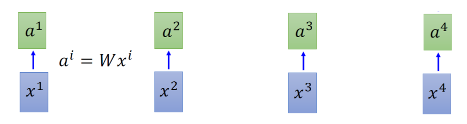

3.将Embedding[$A_1\sim A_4$]分别乘上三个不同的TransformationMatrix[$W_q,W_k,W_v$]，得到三个不同的向量[$q_i,k_i,v_i$]

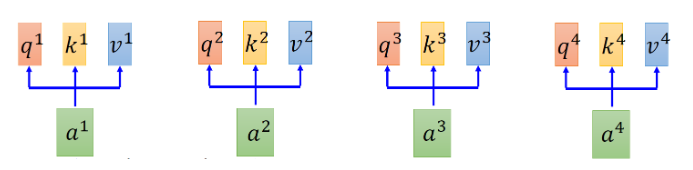

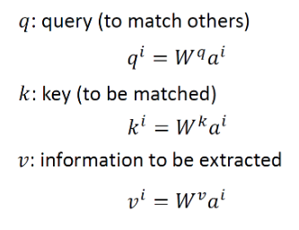

4.Attention操作：

对每个$q_i$和每个$k_j$做Scaled inner product运算，即在计算内积(点积)时对其结果进行缩放操作，得到$\alpha_{i,j}$，具体计算公式为
$$
\alpha_{i,j}=\frac{q_{i} ·k_{j}}{\sqrt{d}}，其中d为嵌入维度
$$

* 如对于$a_1$所得到的$q_1$与$a_3$所得到的$k_3$进行Attention操作，其计算为:$\alpha_{1,3}=\frac{q_1 · k_3}{\sqrt{d}}$​

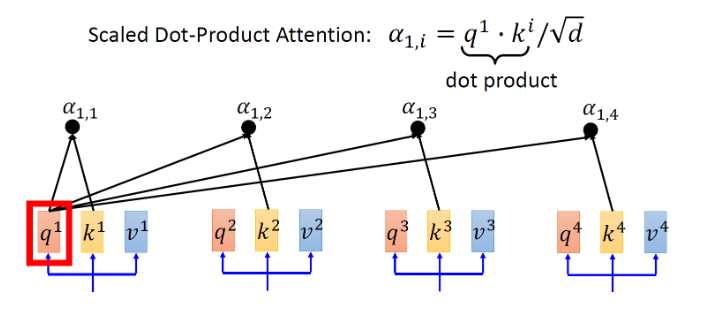

* 代码例子：

    ```python
    import torch
    
    def scaled_inner_product(q, k, d):
        """
        计算 scaled inner product
        
        参数:
        q: 查询向量，形状为 (batch_size, seq_len_q, emb_dim)
        k: 键向量，形状为 (batch_size, seq_len_k, emb_dim)
        d: 嵌入维度
        
        返回值:
        alpha: 缩放后的内积，形状为 (batch_size, seq_len_q, seq_len_k)
        """
        # 计算内积
        inner_product = torch.matmul(q, k)  # (batch_size, seq_len_q, seq_len_k)
        
        # 缩放
        alpha = inner_product / torch.sqrt(torch.tensor(d, dtype=torch.float32))
        
        return alpha
    
    # 示例输入
    q = torch.tensor([[[1, 2], [3, 4]]], dtype=torch.float32)  # 查询向量，形状为 (1, 2, 2)
    k = torch.tensor([[[5, 6], [7, 8]]], dtype=torch.float32)  # 键向量，形状为 (1, 2, 2)
    d = 2  # 嵌入维度
    
    # 调用函数计算 scaled inner product
    result = scaled_inner_product(q, k, d)
    print(result)
    
    ```

    

5.Softmax操作：

对每个 $\alpha$ 进行Softmax运算，得到 $\hat{\alpha}$，计算公式：
$$
\hat{\alpha_{i,j}}=\frac{exp(\alpha_{i,j})}{\sum_kexp(\alpha_{i,k})}
$$
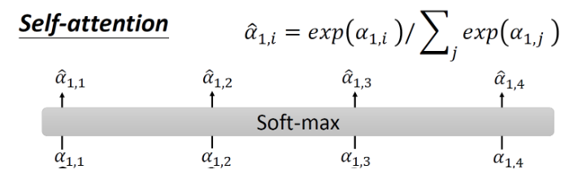

6.将 $\hat{\alpha_{i,j}}$ 和 $v_j$ 做乘法运算，并将其相加，得到 $a_i$ 对应的结果 $b_i$ 。计算公式：
$$
b_i = \sum_j\hat{\alpha_{i,j}}v_j
$$
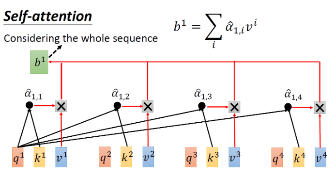

* 由于 $b_1$ 的运算使用到了所有的 $\hat\alpha$ ，因此认为：产生结果的过程使用到整个Sequence的信息。若不需要某个分支，只需使 $\hat\alpha_{1,j}=0$ 即可


## 矩阵表示

1.从 $I = [a_1,a_2,a_3,a_4]$ 得到矩阵Q、K、V

* $Q = [q_1,q_2,q_3,q_4]$ 的每个q都代表着一个向量，即每一行都代表着一个q。K、V同理

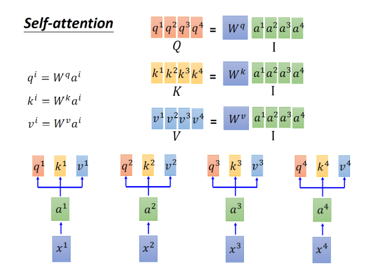

2.Attention操作：将q与k的转置向量进行内积，并对其除以 $\sqrt{d}$ 进行缩放操作。得到的 $\alpha$ 为一个[4 x 4]的矩阵A，由所有的 $\alpha_{i,j}$ 组成。最后再将 $\alpha$ 矩阵进行Softmax操作，得到 $\hat\alpha$ 的[4 x 4]矩阵$\hat{A}$

* 图中省略了缩放操作

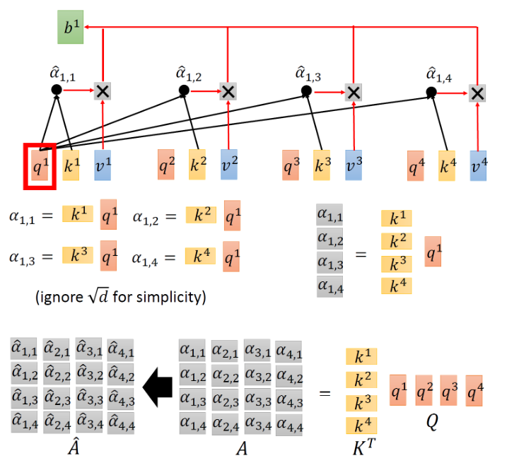

3.将矩阵 $\hat{A}$ 与矩阵V进行相乘操作，得到结果矩阵$O=[b_1,b_2,b_3,b_4]$

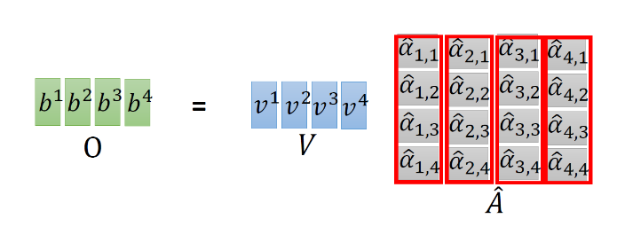

### 完整公式

$$
\hat A = Softmax(A) = Softmax(K^T · Q) \\
O = V · \hat A
$$

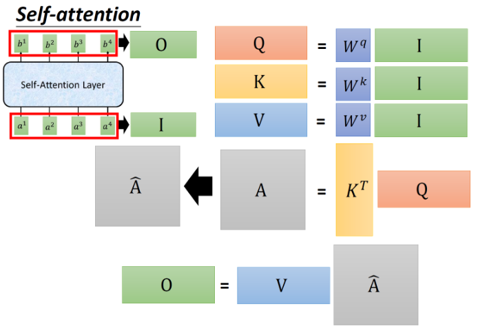

### 矩阵维度

输入矩阵 ：$I ∈ R^{d \times N}$

权重矩阵 ：$W_{q,k,v} = R^{d \times d}$​

中间矩阵 ：$Q,K,V ∈ R^{d \times N}$

$\alpha$矩阵 ：$A∈R^{N \times N}$ => N x d  相乘 d x N

Softmax操作 ： $\hat A ∈ R^{N \times N}$

结果矩阵 ：$ O ∈ R^{d \times N}$


# Multi-head Self-Attention

相比于Self-Attention，只是多了n层[q, k, v]

## 理论表示

**使用2-heads架构**

1.同Self-Attention一样得到[q, k, v]

* [$a_i$, $a_j$]表示经过[$X_1$, $X_2$]与各自的权重矩阵相乘的输入

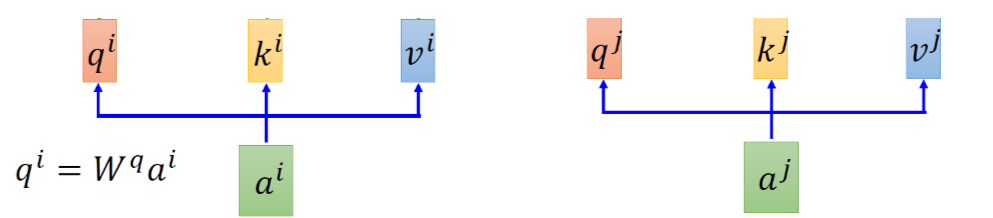

2.对各自的[q, k, v]再乘上权重矩阵W，得到新的 **head**

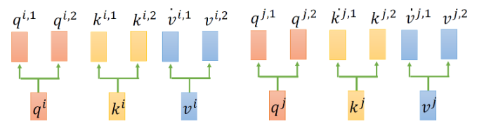

3.与Self-Attention相同，将 $q$ 与相对应的 $k$ 做Attention操作，然后对输出进行Softmax操作，并与对应的 $v$ 相乘，得到head的结果

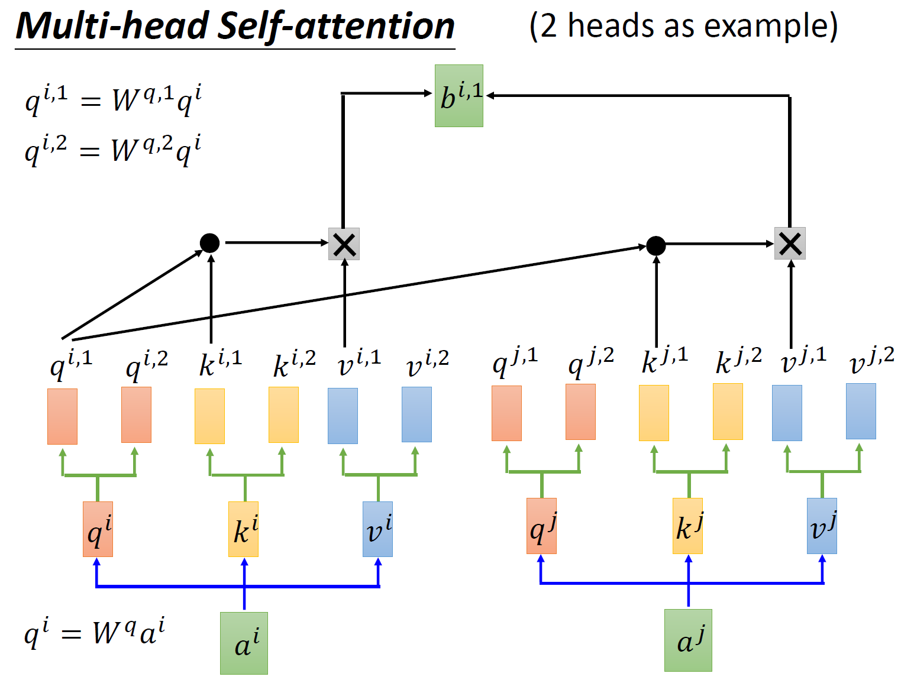

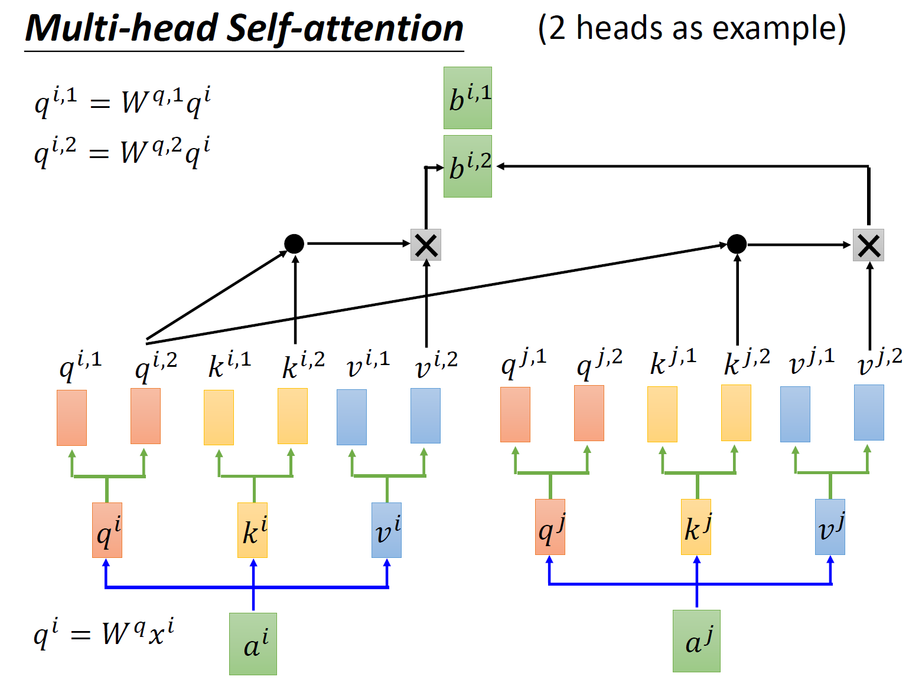

4.将输出的结果 $b$​​ 使用拼接操作(Concat)，再传入到一个Linear层调整维度，使其与输入矩阵维度一致

* 注意，此处的结果 $b_i$ 表示的是输入 $a_i$ 的结果。需要对输入 $a_j$ 做同样的操作并得到 $b_j$ ,最后$b_i,b_j$进行Concat操作并传入Linear得到最终输出O

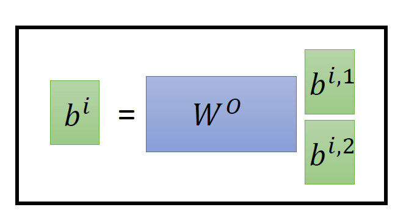

