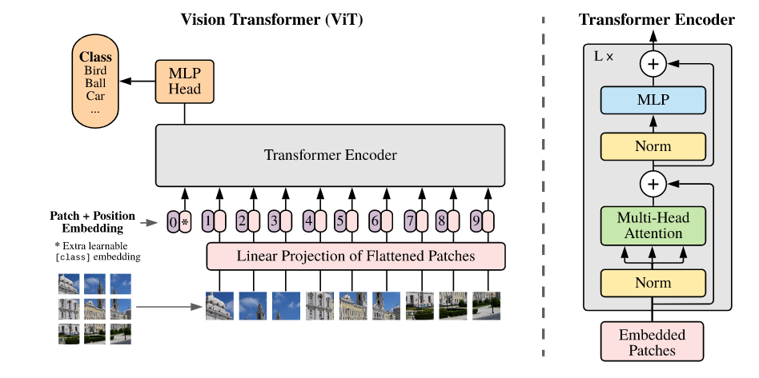
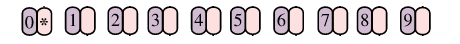
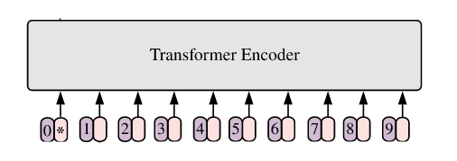
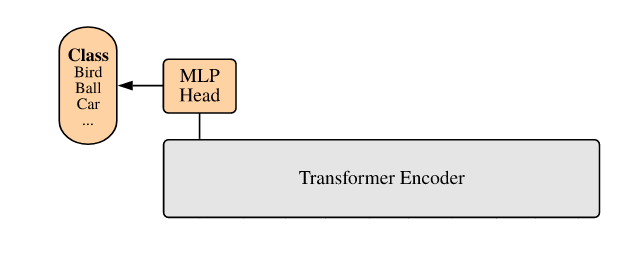
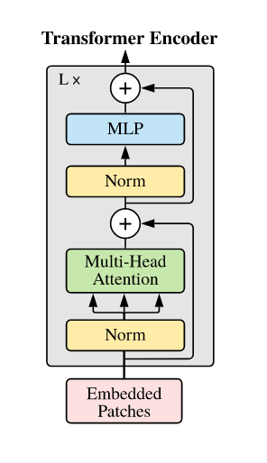

论文：[[2010.11929\] An Image is Worth 16x16 Words: Transformers for Image Recognition at Scale (arxiv.org)](https://arxiv.org/abs/2010.11929)

该论文是2020年Google团队提出的 **将Transformer用于图像分类** 的模型。其优点有当训练足够时，ViT的表现会超过CNN；而缺点是当训练不足时，ViT会比同等大小的ResNet稍差

# 流程




①将输入的图片分成 n x n 个 patch


②将每个patch分别输入到Embedding层，投影为固定长度的向量。加入位置编码Token，用于辨别不同的图片


③在最前方添加一个向量\*，该向量用于分类，同样带有Token



④将全部的向量输入Transform Encoder，仅输出用于分类的向量`*` 



⑤向量 `*` 通过一个MLP，得到最终分类结果




# Embedding层解析

Embedding是一个CNN，用于将图片转换为符合Transformer Encoder输入的情况，即[Tokens_num , Tokens_vim]

-> 设图片大小为 `244 x 244`，将图片分成固定大小的patch，patch的大小为 `16 x 16`，则每张图片会生成$\frac{244\times244}{16 \times 16}=196$个Patch

-> 每个Patch的维度大小为 `16 x 16 x 3(Channels) = 768`

-> 每个线性投影层(Embedding)的维度为 `768 x N`，其中N=768(输入维度为768，输出为768)。即196个Patch经过线性投影层之后总维度依旧为`196 x N`，其中N=768。由于还有一个用于分类的向量 `*` ，因此总维度为`197 x 768`，表示 [Tokens_num , Tokens_vim]

* 在卷积层上，in_channel应为3，表示RGB，并不代表输入的特征图大小，实际上输入[244 x 244]的特征图；out_channel则为768，表示输出的向量长度


## 代码

```python
### Embedding
import torch
import torch.nn as nn

class PatchEmbedding(nn.Module):
	def __init__(self, image_size, patch_size, in_channels, embed_dim):
		super(PatchEmbedding, self).__init__()
		self.image_size = image_size  # 224 x 224
		self.patch_size = patch_size  # 16 x 16
		self.in_channels = in_channels  # 3
		self.embed_dim = embed_dim  # 768
		self.num_patches = (image_size // patch_size) ** 2  # 14*14
		self.patch_embedding = nn.Conv2d(in_channels, embed_dim, kernel_size=patch_size, stride=patch_size)

	def forward(self, x):
		# x: [batch_size, in_channels, image_size, image_size]
		patches = self.patch_embedding(x)  # [batch_size, embed_dim, num_patches_h, num_patches_w]
		patches = patches.permute(0, 2, 3, 1)  # 重新排序:[batch_size, num_patches_h, num_patches_w, embed_dim]
		batch_size, num_patches_h, num_patches_w, _ = patches.size()

		# patches将变为[batch_size, 14*14, 768]
		patches = patches.view(batch_size, num_patches_h * num_patches_w, self.embed_dim)  # [batch_size, num_patches, embed_dim]
		return patches

# Example usage:
image_size = 224
patch_size = 16
in_channels = 3  # RGB image
embed_dim = 768
batch_size = 4  # 4 images

# Create random input image tensor
x = torch.randn(batch_size, in_channels, image_size, image_size)

# Create PatchEmbedding instance
patch_embedding = PatchEmbedding(image_size, patch_size, in_channels, embed_dim)

# Get the embeddings for the input image
embeddings = patch_embedding(x)
print("Embeddings shape:", embeddings.shape)
```

```python
### OUTPUT ###
Embeddings shape: torch.Size([4, 196, 768])
```


# Position Encoding解析

对于每个Patch，都存在一个位置编码。

-> 位置编码可以认为是一张表，共有N行，N的大小与输入序列的长度一样

-> 每行代表一个向量，向量的维度和输入Embedding层的维度相同，即768

-> 位置编码与特征向量是SUM关系，而不是Concat


# Transformer Encoder

架构图



-> 输入的是一个二维数组`I_A`，维度为[token_num, token_vim]，即`197 x 768`

-> 经过Norm层和Multi-Head注意力机制层

-> 经过一个DropOut层(图并未给出),得到`O_A`

-> 将`I_A`与`O_A`做相加操作，得到`I_A`

-> 将上一步的输出`I_B`进入到 Norm层 -> MLP Block模块 -> DropOut层 得到`O_B`

-> 将`I_B`和`O_B`做相加操作，得到`I_C`

↑ 重复以上步骤L次
